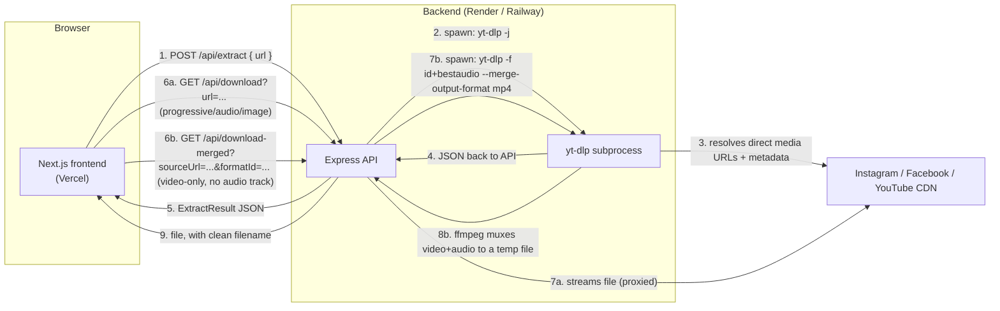

# Architecture

This doc is the "why is it built this way" reference. If you only read one
doc in this repo before making changes, make it this one — the API
reference and both READMEs will make more sense once this clicks.

## The big picture

Two independently deployed services:



Two services instead of one Next.js monolith, specifically because of steps
2, 7a, and 7b/8b: all three need a real, long-running server process, not a
serverless function.

## Why not just do this inside a Vercel serverless function?

Three concrete reasons, not just "best practice":

1. **`yt-dlp` is a subprocess, not a library call.** It's a Python program
   we `spawn()`. Vercel's serverless runtime doesn't give you a writable
   filesystem or a guarantee that arbitrary binaries are even present —
   you'd be fighting the platform instead of building the product.
2. **Execution time.** A slow Instagram response, a large YouTube JSON dump,
   or a big file being proxy-streamed can all take longer than a serverless
   function's execution limit, especially on free/hobby tiers.
3. **Separation of concerns pays off later.** The backend has no idea it's
   being called from a Next.js app — it's a plain REST API. That means you
   could point a mobile app, a CLI, or a Discord bot at the same backend
   without touching it.

## Request walkthrough, end to end

1. User pastes a link into `DownloaderCard` (frontend). Client-side
   `detectPlatform()` (`frontend/lib/platform.ts`) guesses the platform just
   to auto-switch the active tab — this is a UX nicety, **not** a security
   boundary. The backend re-validates independently.
2. On submit, the frontend calls `extractMedia()` (`frontend/lib/api.ts`),
   which is a thin `fetch` wrapper around `POST {API_URL}/api/extract`.
3. The backend route (`backend/src/routes/extract.ts`):
   - validates the body with `zod`,
   - re-checks the platform with its own `detectPlatform()` (server-side,
     can't be bypassed by a modified client),
   - checks the in-memory cache (`services/cache.ts`) — repeated requests
     for the same URL within `CACHE_TTL_SECONDS` skip yt-dlp entirely,
   - on a cache miss, calls `extract()` in `services/ytdlp.ts`.
4. `extract()` spawns `yt-dlp --dump-json <url>` and waits for it to exit.
   yt-dlp's Instagram/Facebook/YouTube "extractors" do the actual reverse
   engineering of each site's internal API — that's the part we're
   deliberately not reinventing, since yt-dlp's maintainers keep it working
   as those sites change.
5. The raw yt-dlp JSON is irregular (a single video looks different from a
   playlist/carousel, which looks different from a photo post). `pickFormats()`
   and `toMediaItem()` normalize all of that into the same `ExtractResult`
   shape the frontend expects, no matter which platform or post type it came
   from. This normalization step is the single most important piece of
   logic in the whole backend — see the inline comments in `ytdlp.ts`.
6. The frontend renders `ResultPreview`, which shows a `<video>`/`` for
   each item and one `QualityButton` per available format.
7. Every download link (and every video/image preview `src`) for a format
   that already has audio points at `GET /api/download`, **not** the raw URL
   yt-dlp resolved. That raw URL is often short-lived or locked to the
   request headers yt-dlp used to obtain it — proxying it through our own
   server means it works reliably in the browser and gets a clean filename
   via `Content-Disposition`.
8. A format whose `needsMerge` flag is `true` (see below) instead points at
   `GET /api/download-merged`, which does real work before it can respond —
   see the next section.

## Video-only formats: merging in audio server-side

YouTube in particular often splits high resolutions (1080p+) into a
video-only stream and a separate audio-only stream that a client is expected
to combine (DASH-style) — a plain proxy of that video-only URL plays back
silently. `pickFormats()` (`backend/src/services/ytdlp.ts`) marks any such
format with `needsMerge: true` on the `MediaFormat` object, and the frontend
branches on that flag (`QualityButton.tsx`) to build a different download
URL:

- **`needsMerge: false`** (progressive video, audio-only, or an image) →
  `buildDownloadUrl()` → `GET /api/download?url=...` — the plain proxy
  described above, no extra work.
- **`needsMerge: true`** → `buildMergedDownloadUrl()` → `GET
  /api/download-merged?sourceUrl=...&formatId=...` — handled by
  `services/merge.ts`, which:
  1. re-runs yt-dlp against the *original post URL* (not the expired-prone
     resolved CDN URL) with `-f "<formatId>+bestaudio/best" --merge-output-format mp4`,
  2. lets yt-dlp's own ffmpeg integration download both streams and mux them
     into a single mp4 on local disk (`os.tmpdir()`),
  3. streams that finished file back to the browser with a clean filename,
  4. deletes the temp file once the response stream closes (success, client
     disconnect, or error — see the `cleanup()` handler in
     `routes/downloadMerged.ts`).

This route is meaningfully more expensive than the plain proxy — it has to
fully download and re-encode/mux before the first byte reaches the browser —
so it gets its own stricter rate limit (`mergeLimiter` in
`middleware/rateLimiter.ts`) and a much longer timeout (120s vs. 25s for
metadata extraction). The frontend shows a "Preparing your file…" state with
a spinner on click for exactly this reason, since a plain anchor download
would otherwise look frozen for up to a minute with no feedback. `formatId`
is validated against a strict allowlist regex before it ever reaches a
spawned process, since it's user-influenced input that ends up inside a CLI
argument.

One sharp edge worth calling out: if ffmpeg isn't installed, yt-dlp doesn't
hard-fail — it logs a `WARNING` and can silently fall back to downloading
just the video stream, no audio, no non-zero exit code. That's exactly the
kind of failure that's invisible unless you're specifically looking for it,
so `merge.ts` checks ffmpeg's availability explicitly *before* ever calling
yt-dlp (`checkFfmpegAvailable()`, cached for the process lifetime) and fails
fast with a clear `FFMPEG_MISSING` error instead. It's also why the merge
spawn no longer passes `--no-warnings` — an earlier version did, which
swallowed exactly the warning that would've explained a failure, leaving
only a generic "Unknown error" in the response.

A second sharp edge, past just getting ffmpeg installed: **the merge
container matters.** The first working version forced
`--merge-output-format mp4`, which merges by remuxing (copying the encoded
data as-is, no re-encoding, for speed) rather than transcoding. mp4 is picky
about what it'll accept that way — muxing a fragmented/DASH-sourced video
track (exactly what a `needsMerge` format is) into mp4 without a re-encode
is a well-documented way to end up with a file that plays audio over a
black screen in some players, even though every byte of video data is
technically present. `mkv` accepts virtually any codec combination as-is,
which is also why it's yt-dlp's own default merge container when you don't
override it. `MERGE_CONTAINER` (default `mkv`) controls this — see
`backend/.env.example`. `routes/downloadMerged.ts` and `findOutputFile()`
in `merge.ts` don't hardcode an extension anywhere; they pick up whatever
container the file actually landed in, so changing this env var is the only
thing you'd need to touch to experiment with it.

## Frontend structure

```
frontend/
  app/                     Route segments (Next.js App Router)
    page.tsx                 Home page (all 3 platforms, tabbed)
    instagram-video-downloader/page.tsx   SEO landing page, locked to Instagram
    facebook-video-downloader/page.tsx    same idea, Facebook
    youtube-video-downloader/page.tsx     same idea, YouTube
    layout.tsx                Root layout: fonts, theme provider, global JSON-LD
    sitemap.ts / robots.ts / manifest.ts / opengraph-image.tsx   SEO file conventions
  components/
    downloader/               Everything the download flow needs (tabs, input,
                               loading/error states, result cards, quality buttons)
    layout/                   Header, footer, theme toggle, ThemeProvider wrapper
    sections/                 Marketing/SEO page sections (How it works, FAQ, …)
    seo/                      JsonLd.tsx — renders a <script type="ld+json">
    ui/                       Small decorative primitives (GradientOrbs)
  lib/
    api.ts                    fetch wrapper around the backend
    platform.ts                client-side URL → platform guesser (UX only)
    seo.ts                     pageSeo()/JSON-LD builder helpers, shared by every page
    types.ts                   Mirrors backend/src/types.ts (kept as a plain duplicate)
    utils.ts                   cn(), formatBytes(), formatDuration(), slugify()
```

`lockedPlatform` is the one prop worth understanding: `DownloaderCard`
renders the full 3-tab switcher on the home page, but on
`/instagram-video-downloader` it's rendered with `lockedPlatform="instagram"`,
which hides the tabs and pins the UI to one platform — same component, two
different SEO-friendly presentations.

## Why the frontend and backend each have their own copy of `types.ts`

There's no shared npm package between them (no monorepo tooling like Turborepo
or workspaces set up here). It's a deliberate simplicity trade-off for a
two-service project this size — if you outgrow it, extracting both copies
into a real shared workspace package is a mechanical refactor, not a design
change.
